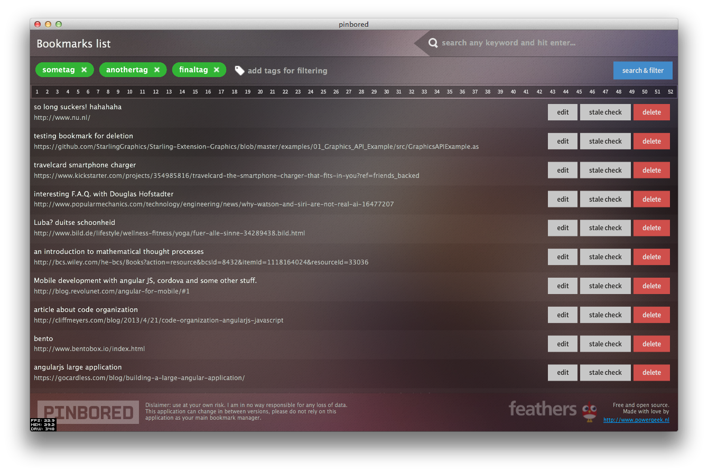
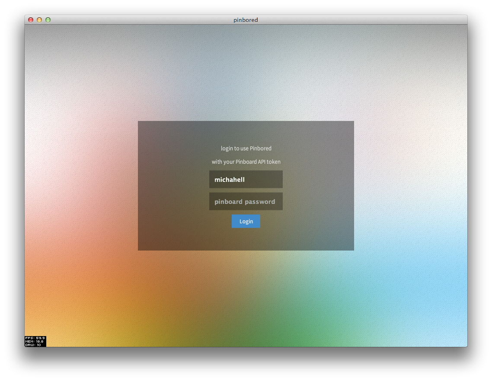

pinbored
========

Why yet another bookmark manager?
---------------------------------
Because i was annoyed with the ~1300 bookmarks that i had on PinBoard, and NO free, open source application that i could use to quickly batch 'CRUD' them. Also, an excuse to create something with the amazing Starling [Feathers UI](https://github.com/joshtynjala/feathers).

Screenshots
-----------

Big fat disclaimer
------------------
Everything is provided AS-IS. Use this project in any way you wish, just not to bother me :) If you have a question i will be happy to answer but i will not feel obliged in any way. Also, i probably violated several conventions of AS3 or the Feathers UI so do not expect perfect Feathers-compliant theming and components :)

Roadmap V1
----------
* show amount of bookmarks retrieved / number of pages in header

* item renderer has, when collapsed, editing capabilities
* edit animations
* update request

* update XML manifest for nice AIR package description etc.
* moar transitional interface design!

* ~~paging bar for paging results in bookmark list screen~~
* ~~able to search through all bookmark text~~
* ~~proper login screen~~
* ~~login functionality~~
* ~~item renderer icon scale fix~~
* ~~delete request~~
* ~~delete animation~~
* ~~basic skin~~

Roadmap V2
----------
* abstract and complete Pager component
* abstract and complete TagInput component
* abstract and complete Pinbored Theme
* release Pinbored theme and skins (maybe separate GitHub repo)
* massive 'stale' checker screen (check all your bookmarks for broken links)
* tag information screen (tag statistics)
* nice bookmark list update animations (bookmarks fading/moving in one by one for example)

libraries used
--------------
* [Starling](https://github.com/PrimaryFeather/Starling-Framework)
* [Starling-Extension-Graphics](https://github.com/StarlingGraphics/Starling-Extension-Graphics/tree/master/examples)
* [Feathers UI](https://github.com/joshtynjala/feathers)
* [Signals AS3](https://github.com/robertpenner/as3-signals)
* [Promise AS3](https://github.com/CodeCatalyst/promise-as3)
* [Twitter Bootstrap](http://getbootstrap.com/css/#buttons), for the button colors used.

gists used
----------
* Josh Tynjala's [HyperlinkTextFieldTextRenderer](https://gist.github.com/joshtynjala/7997065)

credits
-------
* checkmark icon - http://www.flaticon.com/free-icon/check_1682
* font Mono CP?

